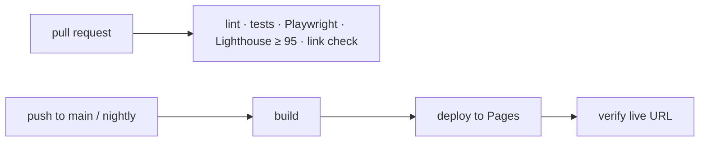

# sameeralam3127.github.io

[](https://github.com/sameeralam3127/sameeralam3127.github.io/actions/workflows/ci.yml)
[](https://github.com/sameeralam3127/sameeralam3127.github.io/actions/workflows/deploy.yml)
[](https://github.com/sameeralam3127/sameeralam3127.github.io/actions/workflows/security.yml)

Portfolio of **Sameer Alam, Infrastructure & Security Engineer**: **[sameeralam3127.github.io](https://sameeralam3127.github.io)**

An interactive terminal, an incident simulator, a live GitHub dashboard and a status panel fed by
the CI pipeline that builds the site.

**Stack:** Astro · TypeScript · Tailwind CSS · React islands · GitHub Actions · GitHub Pages

## Run locally

Requires Node 22.

```bash
npm install
npm run dev      # http://localhost:4321
npm run build    # static site in dist/
npm run check    # lint, format, types, unit tests
```

## Edit content

Site content lives in [`src/data/profile.ts`](src/data/profile.ts). Project write-ups are in
[`src/content/projects/`](src/content/projects/).

## Pipeline



Security scans (gitleaks, npm audit, CodeQL) run on every change. Actions are pinned to commit SHAs
and updated by Dependabot.
