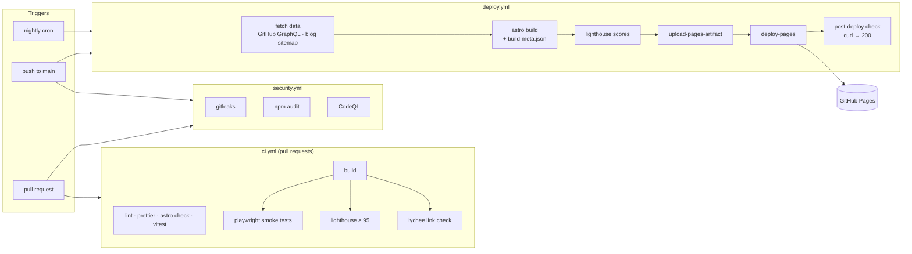

# sameeralam3127.github.io

[](https://github.com/sameeralam3127/sameeralam3127.github.io/actions/workflows/ci.yml)
[](https://github.com/sameeralam3127/sameeralam3127.github.io/actions/workflows/deploy.yml)
[](https://github.com/sameeralam3127/sameeralam3127.github.io/actions/workflows/security.yml)

Portfolio of **Sameer Alam — Infrastructure & Security Engineer**.

**Live:** https://sameeralam3127.github.io

The site is built to show the work, not just describe it: an interactive terminal, an incident
simulator, a GitHub dashboard refreshed on every deploy, a status panel fed by the CI pipeline, and
a clickable diagram of how the site itself ships.

## Architecture



| Layer   | Choice                                                                                                                                   |
| ------- | ---------------------------------------------------------------------------------------------------------------------------------------- |
| Site    | [Astro](https://astro.build) (static output), TypeScript (strictest), Tailwind CSS 4                                                     |
| Islands | React only where interaction is needed: terminal, incident simulator, command palette. Everything else ships as HTML with small scripts. |
| Data    | Build-time JSON from the GitHub API and the Compute Central sitemap; visitors never hit API rate limits                                  |
| Hosting | GitHub Pages via `actions/deploy-pages`, no backend and no secrets in the client                                                         |

## Local development

Requires Node 22 (see `.nvmrc`).

```bash
npm install
npm run dev           # fetch data, then start the dev server on http://localhost:4321
npm run build         # fetch data, build to dist/, write dist/build-meta.json
npm run check         # lint + format check + type check + unit tests
npm run test:e2e      # Playwright smoke tests against dist/ (run `npm run build` first)
npm run audit         # npm audit gate (high/critical, with reviewed exceptions)
```

`npm run data` fetches GitHub stats and the latest articles into `src/data/generated/` (gitignored).
Set `GITHUB_TOKEN` (for example `GITHUB_TOKEN=$(gh auth token) npm run build`) to use GraphQL and
get the full contribution calendar; without it the build uses the public REST API. If the network
is unavailable, the site falls back to curated content and still builds.

## Editing content

| What                                                             | Where                            |
| ---------------------------------------------------------------- | -------------------------------- |
| Name, title, summary, skills, projects, experience, certs, links | `src/data/profile.ts`            |
| Project deep dives (problem → approach → architecture → outcome) | `src/content/projects/<slug>.md` |
| Incident simulator scenarios (branching JSON)                    | `src/data/incidents.json`        |
| Site pipeline diagram                                            | `src/data/architecture.ts`       |
| Navigation and command palette sections                          | `src/data/navigation.ts`         |
| Resume                                                           | `public/Resume.docx`             |

A deep-dive file's name must match a project `slug` in `profile.ts`. Unit tests check content
invariants: unique slugs, valid scenario graphs, and links that resolve.

## CI/CD

| Workflow       | Runs on                               | What it does                                                                                                                                                  |
| -------------- | ------------------------------------- | ------------------------------------------------------------------------------------------------------------------------------------------------------------- |
| `ci.yml`       | pull requests                         | ESLint, Prettier, `astro check`, Vitest, build, Playwright (desktop + 360px), Lighthouse CI with hard budgets of 95 in all four categories, lychee link check |
| `deploy.yml`   | push to `main`, nightly, manual       | Build with fresh data, record build metadata and Lighthouse scores, deploy to Pages, then verify the live URL returns 200                                     |
| `security.yml` | push to `main`, pull requests, weekly | gitleaks secret scan, `npm audit` gate, CodeQL (security-extended)                                                                                            |

All actions are pinned to full commit SHAs and kept current by Dependabot (`.github/dependabot.yml`).
Workflows use least-privilege `permissions`; only the deploy job can write to Pages.

Accepted audit advisories live in `.audit-allowlist.json` with a reason and an expiry date.
Expired entries fail the audit so they get re-reviewed.

### One-time setup

In the repository: **Settings → Pages → Build and deployment → Source: GitHub Actions**.

Recommended: protect `main` and require the `CI` and `Security` checks before merging.
